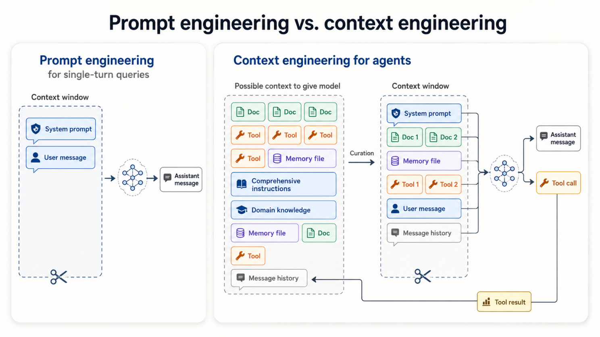
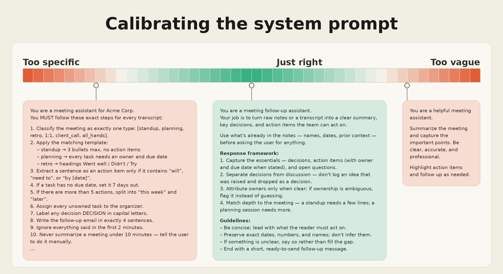

# The Real Bottleneck for AI Agents Isn't the Model. It's the Context.

The more I work with agents, the more convinced I am that the model is rarely the actual bottleneck. It's the workspace we give it.

For the last couple of years, most of the discussion has been about prompt engineering - getting the wording right, using the right structure, telling the model to think step by step. That still matters for simple questions. But once you start building agents that use tools, maintain state, follow multi-step processes, or work across long-running tasks, prompt engineering stops being enough.

> At that point, the real work becomes context engineering.

Not just "What do I ask the model?" but instead:

* What does it actually need to know right now?
* What should it ignore?
* What history still matters?
* What tools should it have access to?
* What instructions are helping versus adding noise?
* What should be fetched later instead of stuffed into the prompt upfront?

That shift matters because context is finite. Even with bigger context windows, the model still has a limited amount of attention. Every instruction, document, tool definition, policy note, and chat message competes for it. And that's where a lot of agentic systems quietly degrade.

## More context is not always better

It's tempting to assume the fix is always more - more documents, more examples, more rules, more history, more edge cases. But models behave a lot like people here.

Give someone a clean two-page brief and they can usually work through it. Give them the same key facts buried in a 300-page binder and the problem stops being intelligence. It becomes attention.

The same thing happens with models. Researchers have started calling it "context rot," and the name fits. As context gets larger and messier, the model may technically have access to the right information, but its ability to reliably surface and use it drops. The goal isn't to fill the context window. It's to give the model the smallest useful set of information that lets it do the job well.

That's a different mindset. It moves you from "How much can I give it?" to "What deserves its attention right now?"

## Prompt engineering vs. context engineering

> Prompt engineering is mostly about wording. Context engineering is about the operating environment.

A good prompt says: "Here's what I want you to do." Context says: "Here's the role, the goal, the relevant history, the available tools, the current state, the constraints, and the information you should actually use to decide what to do next."

For a single-turn question, a well-written prompt can be enough. For an agent, it usually isn't. An agent needs to understand what tools it can use, when to use them, what prior work still matters, which rules are mandatory versus guidance, and when it should stop and ask for help. That's why context engineering is becoming one of the most important practical skills in building reliable agents. It's less about crafting the perfect sentence and more about designing the model's workspace.

## The Goldilocks problem

One of the clearest places this shows up is the system prompt.

If it's too vague, the model gets handed a generic job description: "Be helpful. Be accurate. Follow policy. Escalate when needed." That sounds reasonable until you realize it gives the model almost no real shape. It's like telling a new engineer, "Just fix Azure issues and use good judgment." Good luck with that.

If it's too specific, it becomes a brittle wall of rules: classify every issue into one of these buckets, ask these ten questions in this exact order, never deviate, never infer. That fails too, just in a different way. Real work is messy. Incidents don't follow the runbook. Customers don't describe problems cleanly. The model needs guidance, but it also needs room to reason.

The best system prompts live in the middle — specific enough to define the role, goal, tools, guardrails, and response style, while still flexible enough to handle variation.

## What good context engineering actually looks like

The better systems I've seen tend to do a few things consistently:

* They stay clear without trying to be exhaustive. They give the model a clear role, a decision framework, and boundaries instead of encoding every possible edge case. A useful test: if a capable human would struggle to follow the instructions cleanly, the model probably will too.
* They use examples instead of endless rules. A few well-chosen examples usually teach the model what "good" looks like better than a long list of exceptions. Examples carry tone, judgment, and decision-making patterns that rules often miss.
* They retrieve information just in time. Instead of dumping every document, policy, runbook, and chat thread into context upfront, stronger systems let the agent pull what it needs when it needs it. That's closer to how people actually work. You don't memorize your entire inbox before answering one email. Agents shouldn't have to carry everything either.
* They maintain working memory across long tasks. For research, migrations, incident investigations, or multi-hour workflows, the model doesn't need the entire history in active context. It needs a useful summary of what's been tried, what was decided, what evidence matters, and what's still unresolved. External notes, state files, and summaries let the system carry forward the important parts without dragging the whole conversation behind it.

> Sometimes the model doesn't need to get smarter. The system around it just needs to get better at managing context.

## The real skill

This isn't just relevant if you're building agents. Anyone using AI tools for drafting, research, analysis, or review is already making context decisions — whether they realize it or not. The quality of the output often depends less on how cleverly you phrased the question and more on what you chose to put in front of the model and what you chose to leave out.

Models will keep getting better. Context windows will keep growing. Tool use will improve. But I don't think the core constraint disappears. Attention is still finite. The model still has to decide what matters, and the quality of that decision depends heavily on the context we give it.

> So the real skill isn't just learning how to prompt. It's learning how to curate.

What belongs in the model's attention right now? What should be stored somewhere else? What should be retrieved later? What should be summarized or deleted entirely?

The best prompt in the world won't save a cluttered context. Often, the most powerful move isn't adding more information. It's knowing what to leave out.

---

📎 **Download the full-resolution diagram:** [calibrating-system-prompt.png](images/calibrating-system-prompt.png)

*Originally published on [LinkedIn](https://www.linkedin.com/pulse/real-bottleneck-ai-agents-isnt-model-its-context-michael-robinson-n3aac/), June 28, 2026.*

*© 2026 Michael Robinson. This article and its images are licensed under [CC BY 4.0](https://creativecommons.org/licenses/by/4.0/) — reuse with attribution.*
