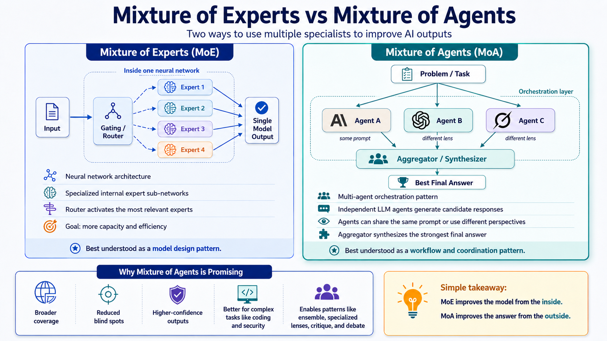
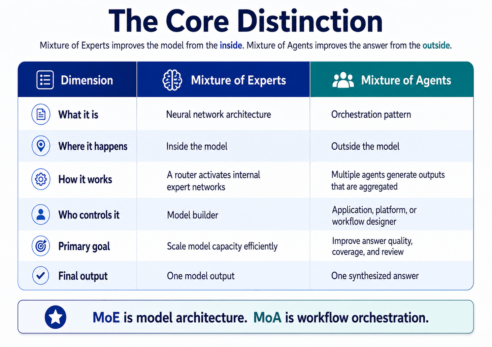
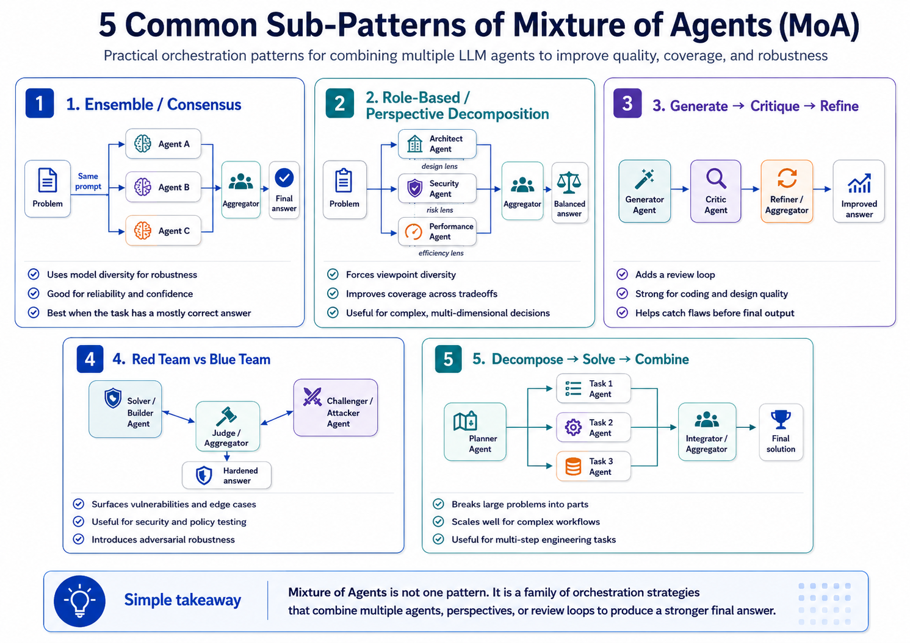

# Mixture of Experts vs. Mixture of Agents: One Improves the Model, the Other Improves the Answer

As more of us move from using AI to building with AI, some concepts that sound similar can create real confusion.

Two of those concepts are Mixture of Experts and Mixture of Agents.

They sound almost identical. Both involve using multiple "specialists" to improve results. But they operate at very different layers of the AI stack, and that difference matters when making architecture, platform, and delivery decisions.

The simplest way I think about it is this:

**Mixture of Experts improves the model from the inside.**
**Mixture of Agents improves the answer from the outside.**

That distinction helps clarify where the value is coming from and how each pattern can be applied in real-world IT environments.

## Mixture of Experts: Specialists Inside One Model

Mixture of Experts, often shortened to MoE, is a neural network architecture.

It is a design choice built into the model itself.

A traditional dense model uses all, or nearly all, of its parameters for every token it processes. That can be powerful, but it is also expensive.

An MoE model works differently. It contains multiple internal expert networks, and a routing system, often called a gate, decides which of those experts should be activated for a given token or segment of input.

The important point is that the experts live inside the neural network.

As users, developers, architects, or IT leaders, we usually do not see or control those experts directly. From the outside, the model still behaves like one model.

It is tempting to describe those experts as "the coding expert" or "the math expert," but that is a simplification. In practice, the routing is learned by the model, and the experts are not usually exposed as clean human-readable roles. The specialization may be real, but it is internal to the model.

The value of MoE is mostly about scale and efficiency.

The model can have a very large total capacity while only activating a subset of that capacity for any given token. In practical terms, MoE is one way to increase model capability without paying the full compute cost of running every parameter every time.

A simple analogy: MoE is like one company with many specialized departments behind the scenes. A dispatcher routes the work internally, but the customer still experiences one company and one final service.

## Mixture of Agents: Specialists Coordinated From Outside

Mixture of Agents, or MoA, is different.

MoA is not a neural network architecture. It is an orchestration pattern.

The underlying model does not have to change. Instead, we make several independent model calls and coordinate the outputs.

In this context, an "agent" does not have to mean a fully autonomous digital worker. It can simply mean a separate model call with its own prompt, role, tools, or evaluation criteria.

In a Mixture of Agents setup, several agents work on the same problem. They might use the same model or different models, receive the same prompt or different prompts, take on different roles, use different tools, or evaluate the problem through different criteria.

Then an aggregator, often another model, reviews the outputs and produces one final answer.

A simple example:

* One agent gives a technical answer
* One agent gives a business-oriented answer
* One agent checks for security and risk
* One agent critiques the others
* The aggregator combines the strongest points into a final recommendation

The key point is the reverse of MoE.

With MoA, the specialists sit outside the base model. They are separate calls, coordinated by a workflow or orchestration layer that we design.

A simple analogy: MoA is like bringing several specialists into a review meeting, then having a senior leader synthesize the strongest points into one recommendation.

## The Core Distinction

These are not competing ideas.

You can run a Mixture of Agents workflow on top of models that are themselves built using Mixture of Experts.

That is part of what makes this space interesting. Some improvements happen inside the model. Others happen in how we orchestrate, evaluate, and synthesize model outputs.

## Why Mixture of Agents Matters for IT Leaders

MoE is important to understand, but most enterprise teams will not directly design MoE architectures. We may choose models that use MoE, but we are usually not building that layer ourselves.

MoA is different.

Mixture of Agents is something application teams, platform teams, security teams, and automation teams can actually design and implement.

That makes it practical.

It also means we need to apply it with discipline.

More agents can mean more cost, more latency, more complexity, and more places for the system to fail. The opportunity is better-designed review, synthesis, and decision workflows around AI outputs.

## Five Useful Mixture of Agents Patterns

Once you think of MoA as multiple coordinated model calls plus a synthesizer, it becomes clear that there is not just one pattern.

There is a family of useful patterns.

The names are not fully standardized across the industry yet, but these 5 patterns are worth understanding.

### 1. Ensemble, Voting, or Consensus

This is the simplest version.

You give the same prompt to multiple models or agents and compare the answers.

The variation comes from differences between the models: training data, alignment, reasoning patterns, and output behavior.

The aggregator looks for where the answers agree, where they disagree, and whether the final answer should select, rank, or merge the responses.

This works best when the task has a mostly correct answer, such as bug diagnosis, code review, or detection logic.

The value is confidence.

If several strong models independently reach the same conclusion, that is a useful signal. If they disagree, that is also useful because it tells you where uncertainty exists.

Mental model: Ask 3 experienced engineers the same question and see where they agree.

### 2. Role-Based or Perspective Decomposition

This pattern is more deliberate.

Instead of giving every agent the same prompt, you give each agent a different lens.

For example, in a software or architecture review:

* One agent acts as a senior architect focused on maintainability
* One agent acts as a security engineer focused on risk
* One agent acts as a performance engineer focused on latency and cost

The same problem is reviewed from multiple perspectives.

The aggregator combines the useful points and resolves the tradeoffs.

This is valuable because most real IT decisions are not one-dimensional. The "best" solution is rarely just the cheapest, fastest, most secure, or easiest option. It is usually a balanced decision across several competing concerns.

Mental model: Bring in specialists, then have a lead synthesize the recommendation.

### 3. Generate → Critique → Refine

This pattern mirrors how good engineering work already happens.

One agent creates an initial answer or solution. Other agents review it for flaws. Then the response is revised.

This pattern is often stronger than simply running several agents in parallel because it creates an explicit feedback loop.

It is useful for work like code generation, design reviews, security reviews, and migration planning.

Mental model: Write → review → refine.

### 4. Red Team vs. Blue Team

This is the adversarial version of Mixture of Agents.

One agent tries to solve, build, or defend. Another agent tries to break, bypass, or challenge the solution. The aggregator decides what survives.

This pattern is especially useful in security, governance, and risk management.

The value is that the system is forced to look for failure modes instead of only producing a polished answer. That matters because many real failures come from things nobody thought to check.

Mental model: One agent builds. One agent attacks. The final answer gets stronger.

### 5. Decompose → Solve → Combine

This is the planner pattern.

A planning agent breaks a larger problem into smaller parts. Several agents solve the parts. An aggregator assembles the final result.

This is useful when the task is too large, too broad, or too multi-step for a single pass.

The planner needs to define the parts clearly. The agents need to know their specific responsibilities. The aggregator needs to make sure the final result fits together coherently.

Mental model: Architect → team → integration.

## Two Lower-Cost Variations

There are also simpler patterns worth knowing.

Self-consistency, sometimes called N-sampling, runs the same model on the same prompt multiple times and keeps the most consistent or strongest answer. This is a budget-friendly version of ensembling.

Debate has agents argue different positions while an aggregator judges. This can help with ambiguous or high-stakes decisions where the reasoning matters as much as the answer.

These are not always full Mixture of Agents implementations, but they come from the same general idea: generate multiple views, then select or synthesize more carefully.

## The Aggregator Is the Constraint

This is the part I think many teams will underestimate.

The aggregator decides whether the system works.

If the aggregator is weak, adding more agents may just produce a longer answer at 3 to 5 times the cost without meaningfully improving quality.

A strong aggregator should do more than summarize.

It should:

* Identify where agents agree
* Identify where agents disagree
* Determine why they disagree
* Weigh credibility
* Recognize unsupported claims
* Resolve conflicts
* Preserve important tradeoffs
* Produce a clear final answer

In higher-risk domains, I would also want more structure.

For security work, for example, I would not want a loose paragraph summary. I would want structured outputs such as:

* Finding
* Severity
* Confidence
* Evidence
* Affected component
* Recommended remediation
* Open questions

That structure gives the aggregator something more rigorous to reason over.

The lesson is simple: **the quality of a Mixture of Agents system depends less on the number of agents and more on the quality of the aggregation.**

## When I Would Use Mixture of Agents

I would consider MoA when the problem is complex, high-value, ambiguous, or expensive to get wrong.

Examples include:

* Security threat analysis
* Architecture reviews
* Complex software changes
* Production incident analysis
* Cloud migration planning
* Policy and control interpretation
* Executive-ready synthesis of complex topics
* Decisions with meaningful tradeoffs across cost, risk, speed, and maintainability

In these scenarios, the value is fewer blind spots, better review, clearer tradeoffs, and more confidence in the final recommendation.

## When I Would Not Use Mixture of Agents

I would not use MoA by default.

For routine summarization, simple drafting, basic Q&A, low-risk content generation, or tasks where one strong model is already good enough, MoA may not justify the extra cost and latency.

This is an important discipline.

AI architecture can become over-engineered just like any other architecture.

If one model produces a good enough answer, use one model.

If the task needs multiple perspectives, review, adversarial challenge, or synthesis, then MoA may be worth the extra complexity.

## How I Would Roll This Out

I would not start with a complex 5-agent workflow.

Start with a baseline.

Use one strong model first. Measure the quality of that answer. Then test a simple MoA pattern against it.

A practical first step might look like this:

1. Send the same prompt to 3 models.
2. Have a single aggregator synthesize the results.
3. Compare the final answer against the best single-model answer.
4. Decide whether the improvement justified the added cost and latency.

If it helps, add one more layer of structure. For example:

* Add a security reviewer
* Add a critique pass
* Add a red-team challenge
* Add structured scoring
* Add a rule-based validation step

Only add complexity when each step earns its place.

Otherwise, we risk building impressive-looking workflows that do not actually outperform a single well-prompted model.

## The Takeaway

The distinction I keep coming back to is this:

**Mixture of Experts improves the model from the inside.**
**Mixture of Agents improves the answer from the outside.**

MoE is about model architecture and efficient scale.

MoA is about workflow design, review, synthesis, and coordination.

For IT leaders, architects, engineers, and security teams, MoA is worth understanding because it gives us a practical way to improve AI outputs without waiting for the next model release.

But it only works when we use it intentionally.

Same prompt across multiple models can buy consistency and confidence.

Different roles can buy coverage and depth.

Critique and adversarial patterns can improve quality and catch failures a single pass might miss.

But the system lives or dies by the aggregator.

That may be the bigger lesson: better AI outcomes will not come only from better models. They will also come from better ways of coordinating, challenging, validating, and synthesizing what those models produce.

---

📎 **Download the high-resolution visuals:** [MoE-vs-MoA-visuals.pdf](images/MoE-vs-MoA-visuals.pdf) — all three diagrams in one print-ready PDF.

*© 2026 Michael Robinson. This article and its images are licensed under [CC BY 4.0](https://creativecommons.org/licenses/by/4.0/) — reuse with attribution.*
